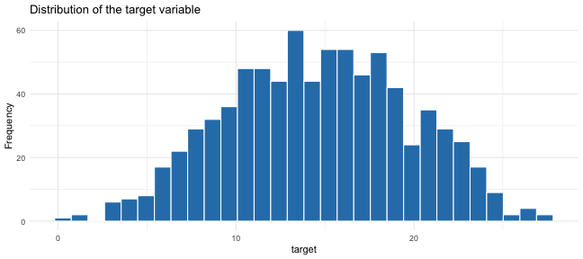
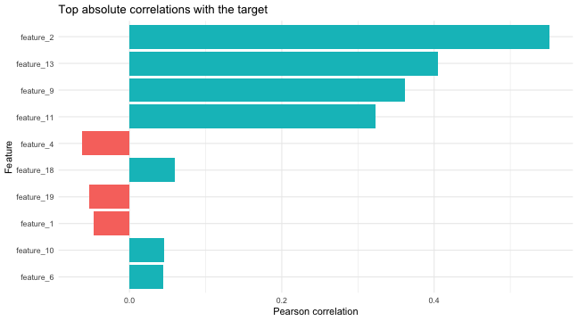
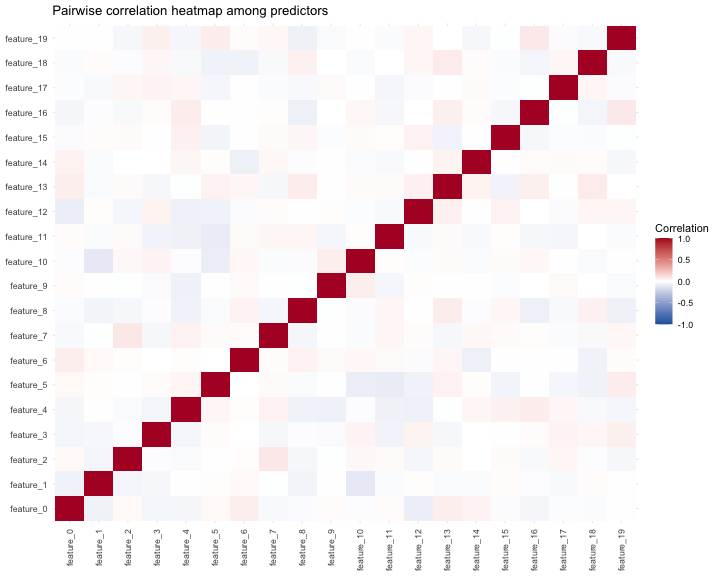
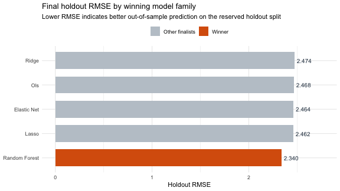
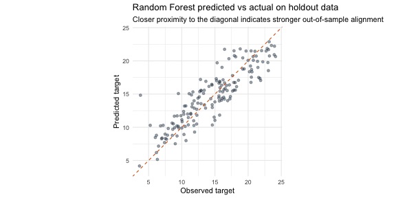
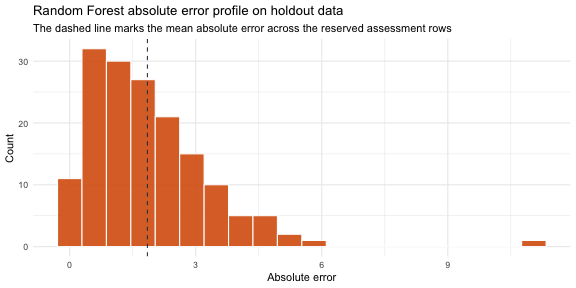
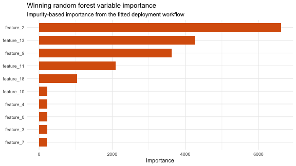

# Predicting the Blind Test

## End-to-end methodology and model selection

::: hero-note
Goal: build a regression workflow from 800 labeled rows and generate 200 blind-test predictions in the required `target_pred` format.
:::

------------------------------------------------------------------------

## Challenge Objective

The challenge required five concrete tasks:

- Validate whether preprocessing was needed and justify the decision.
- Evaluate whether feature selection was necessary and justify the decision.
- Train one or more regression models on the labeled dataset.
- Use robust evaluation procedures and explicitly guard against overfitting.
- Export 200 predictions for the blind test as a one-column CSV.

## Analytical stance

- Treat the notebook as the single source of truth.
- Keep the workflow auditable from raw CSVs to final predictions.
- Prioritize generalization over in-sample fit because the target contains noise.

------------------------------------------------------------------------

## Methodology Backbone

### CRISP-DM guided the full workflow

1.  Business understanding
2.  Data understanding
3.  Data preparation
4.  Modeling
5.  Evaluation
6.  Deployment

## Why this structure mattered

- It kept the process sequential and easy to defend.
- It separated exploration from model selection.
- It preserved one final handoff from the chosen workflow into deployment.

------------------------------------------------------------------------

## Data Inputs

### Files used in the challenge

- `training_data.csv`: 800 rows, 20 numerical predictors, 1 target column
- `blind_test_data.csv`: 200 rows, same 20 predictors, no target

### Integrity checks performed before modeling

- Expected structure vs observed structure
- Column alignment between training and blind test data
- Missing-value scan
- Duplicate-row scan
- Type audit and numeric recovery

## Outcome

- The local files matched the brief exactly.
- Both datasets were complete and usable without repair.

------------------------------------------------------------------------

## Data Quality Findings

### Main conclusion

The delivered files were unusually clean, so the preparation stage could remain simple and transparent.

### What the notebook confirmed

- `0` training rows with missing values
- `0` blind-test rows with missing values
- `0` duplicated training rows
- `0` duplicated blind-test rows

### Modeling implication

- No imputation was needed.
- No rows had to be discarded.
- No manual feature removal was justified at the preparation stage.

------------------------------------------------------------------------

## Exploratory Signal Check

::::: columns
::: {.column width="52%"}
### Target distribution

- The target had enough spread to support regression.
- The notebook checked shape, center, dispersion, and potential outliers.
- This matters because skewness and heavy tails can affect residual behavior later.

### Predictor review

- The project profiled predictor spread and outlier behavior.
- It also checked pairwise correlations to understand multicollinearity risk.
:::

::: {.column width="48%"}
{fig-alt="Target distribution" width="100%"}
:::
:::::

------------------------------------------------------------------------

## Relationship Structure

::::: columns
::: {.column width="48%"}
{fig-alt="Top correlations with target" width="100%"}
:::

::: {.column width="52%"}
### What this exploration was used for

- Rank predictors by marginal correlation with the target
- Visually inspect the strongest individual relationships
- Inspect dependence patterns among predictors before fitting linear models

### Key methodological takeaway

The notebook did not use this section to hand-pick variables manually. It used it to understand the data and then let recipes and model families handle preprocessing consistently.
:::
:::::

------------------------------------------------------------------------

## Correlation Map

::::: columns
::: {.column width="55%"}
### Why this mattered

- OLS and penalized linear models can react differently when predictors overlap.
- A global correlation view helps anticipate multicollinearity and redundancy.
- It also motivates why regularized models were worth comparing against plain OLS.

### Decision

- Keep all predictors initially
- Let recipes remove only zero-variance columns
- Test PCA as an unsupervised dimensionality-reduction alternative
:::

::: {.column width="45%"}
{fig-alt="Predictor correlation heatmap" width="100%"}
:::
:::::

------------------------------------------------------------------------

## Data Preparation Logic

### The preparation phase followed four simple rules

1.  Keep all original predictors.
2.  Preserve the numeric representation recovered from the raw files.
3.  Keep all supervised training rows because there were no incomplete observations.
4.  Keep the blind test dataset intact for final scoring.

### Why this is defensible

- The data did not require cleaning-heavy preprocessing.
- The notebook avoided arbitrary manual feature dropping.
- Preparation stayed minimal so model comparison would remain fair and reproducible.

------------------------------------------------------------------------

## Modeling Design

### Evaluation backbone

- `80/20` train-test split
- `5-fold` cross-validation on the training split
- Stratification on `target`
- Common metric set: `RMSE`, `MAE`, `R²`

### Model families compared

- OLS
- Ridge
- Lasso
- Elastic Net
- Random Forest

### Shared principle

The holdout set was not used to choose the family winner. Cross-validation decided the winner first, and the holdout was used only once at the end.

------------------------------------------------------------------------

## Preprocessing by Model Family

### Recipes tested

- Base recipe: zero-variance filtering only
- Normalized recipe: scaling for magnitude-sensitive models
- PCA recipe: normalization plus PCA with Kaiser criterion

### Family-specific strategy

- OLS: raw and PCA variants
- Ridge: normalized and PCA variants
- Lasso: normalized and PCA variants
- Elastic Net: normalized and PCA variants
- Random Forest: minimal preprocessing plus hyperparameter tuning

### Rationale

Each family competed under transformations that make methodological sense for that estimator instead of forcing one preprocessing path on every model.

------------------------------------------------------------------------

## Cross-Validated Model Ranking

{fig-alt="Cross-validated model ranking" width="80%"}

### Final family ranking by cross-validated RMSE

| Model         | Variant               |  CV RMSE |
|---------------|-----------------------|---------:|
| Random Forest | minimal_preprocessing | 2.615919 |
| Lasso         | normalized            | 2.840765 |
| Elastic Net   | normalized            | 2.842309 |
| OLS           | raw                   | 2.845045 |
| Ridge         | normalized            | 2.848861 |

------------------------------------------------------------------------

## Winning Model

### Selected workflow

- **Winner:** Random Forest
- **Variant:** `minimal_preprocessing`

### Why it won

- It achieved the lowest cross-validated RMSE.
- It outperformed every linear and regularized alternative.
- The margin over the runner-up lasso was meaningful enough to justify the final selection.

### Interpretation

The data likely contains nonlinear structure or interactions that the linear families could not capture as effectively.

------------------------------------------------------------------------

## Holdout Validation

### Final metrics on untouched data

| Metric |     Value |
|--------|----------:|
| RMSE   |  2.523354 |
| MAE    |  1.975047 |
| R²     | 0.7449495 |

### Why this slide matters

- The model was not chosen because of holdout performance.
- The holdout was used only after cross-validation had already selected the family winner.
- This keeps the evaluation story statistically cleaner and easier to defend.

------------------------------------------------------------------------

## Predicted vs Actual on Holdout

{fig-alt="Predicted versus actual for winning model" width="78%"}

### Reading the chart

- Points close to the diagonal indicate better agreement.
- The cloud follows the diagonal reasonably well, which supports the holdout metrics.
- Errors exist, but the fit is consistent with a model that generalizes better than the linear baselines.

------------------------------------------------------------------------

## Error Profile of the Winner

::::: columns
::: {.column width="52%"}
{fig-alt="Absolute error profile" width="100%"}
:::

::: {.column width="48%"}
### Absolute error summary

- Mean absolute error: `1.975047`
- Median absolute error: `1.670238`
- Maximum absolute error: `8.361734`

### Interpretation

- Most errors remain concentrated in a moderate range.
- The maximum error shows that the model still misses some observations by a larger margin.
- That pattern is normal in noisy regression problems and does not invalidate the overall selection.
:::
:::::

------------------------------------------------------------------------

## Variable Importance

{fig-alt="Random forest variable importance" width="78%"}

### How to interpret this slide

- These are impurity-based importance scores from the final fitted forest.
- They are useful for interpretation, not for model selection.
- The notebook uses them to explain which predictors contributed most inside the nonlinear ensemble.

------------------------------------------------------------------------

## Deployment Output

### Final operational step

- Score the `200` blind-test rows with the selected workflow
- Rename the prediction column to `target_pred`
- Export the submission file to:

`output/blind_test_predictions.csv`

### Deliverable status

- File exists
- One-column format preserved
- Ready for submission

------------------------------------------------------------------------

## Final Takeaways

### What this project demonstrates

- A clean and auditable R workflow from raw files to final predictions
- Proper separation between model selection and final validation
- A justified comparison between interpretable linear baselines and a nonlinear ensemble

### Bottom line

Random Forest was the strongest predictive choice for this dataset.

The final deployment followed a defensible validation process instead of a holdout-driven shortcut.
